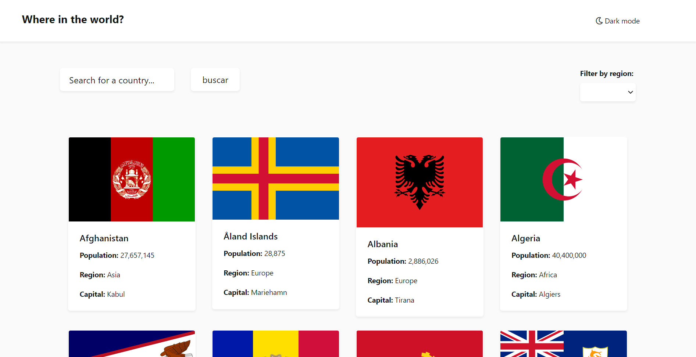
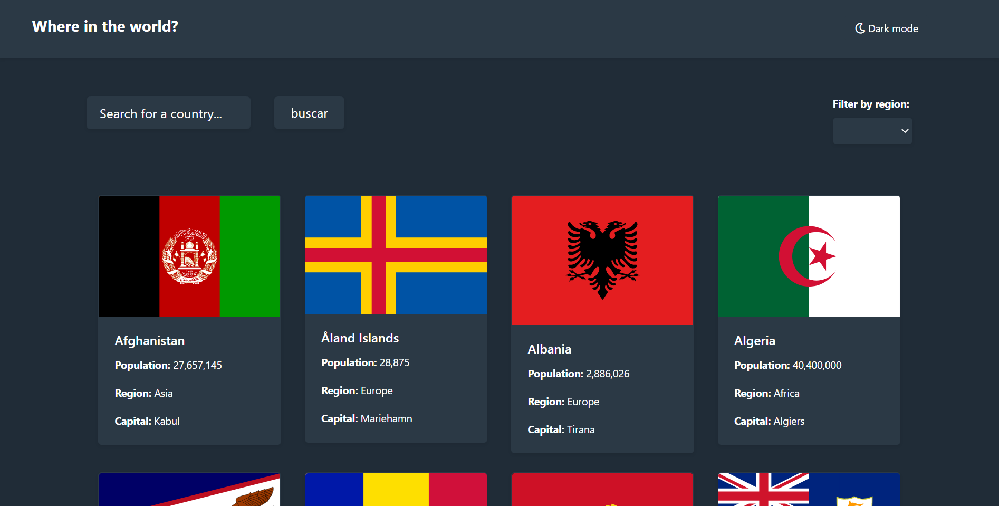
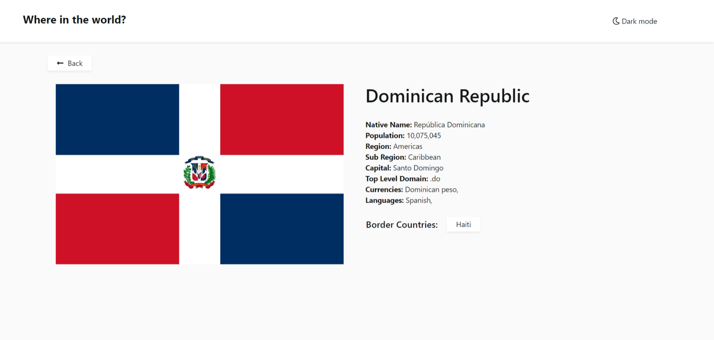
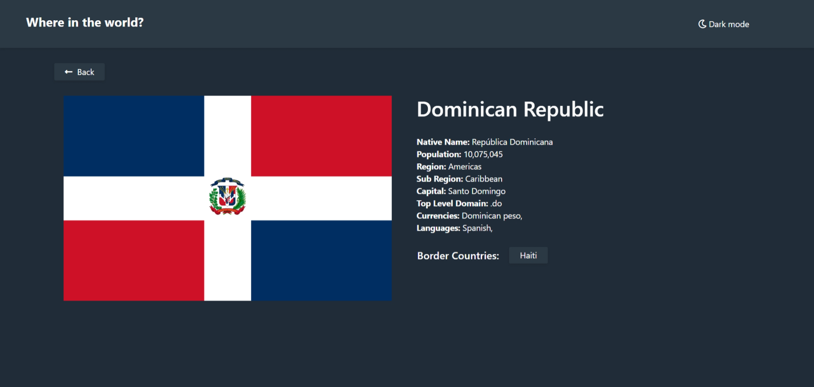

# Frontend Mentor - REST Countries API with color theme switcher solution

This is a solution to the [REST Countries API with color theme switcher challenge on Frontend Mentor](https://www.frontendmentor.io/challenges/rest-countries-api-with-color-theme-switcher-5cacc469fec04111f7b848ca). Frontend Mentor challenges help you improve your coding skills by building realistic projects. 

## Table of contents

- [Overview](#overview)
  - [The challenge](#the-challenge)
  - [Screenshot](#screenshot)
  - [Links](#links)
- [My process](#my-process)
  - [Built with](#built-with)
  - [Useful resources](#useful-resources)
- [Author](#author)

## Overview

### The challenge

Users should be able to:

- See all countries from the API on the homepage
- Search for a country using an `input` field
- Filter countries by region
- Click on a country to see more detailed information on a separate page
- Click through to the border countries on the detail page
- Toggle the color scheme between light and dark mode *(optional)*

### My Solution Screenshot

  
  
    

### Links

- Not yet

## My process

### Built with

- Semantic HTML5 markup
- CSS custom properties
- [React](https://reactjs.org/) - JS library
- [REST Countries](https://restcountries.eu/) - API

### Useful resources

- [Font Awesome](https://fontawesome.com/) - I really liked this website to get some icons and will use it going forward.
- [W3Schools](https://www.w3schools.com/) - It's very useful. I'd recommend it to anyone still learning about programming.

- [Frontend Mentor](https://www.frontendmentor.io/challenges) - This website is really useful to put your frontend skills to test and practices. It also give you some resources to begin a challenge like this one.

## Author

- Frontend Mentor - [@GleXan14](https://www.frontendmentor.io/profile/GleXan14)
